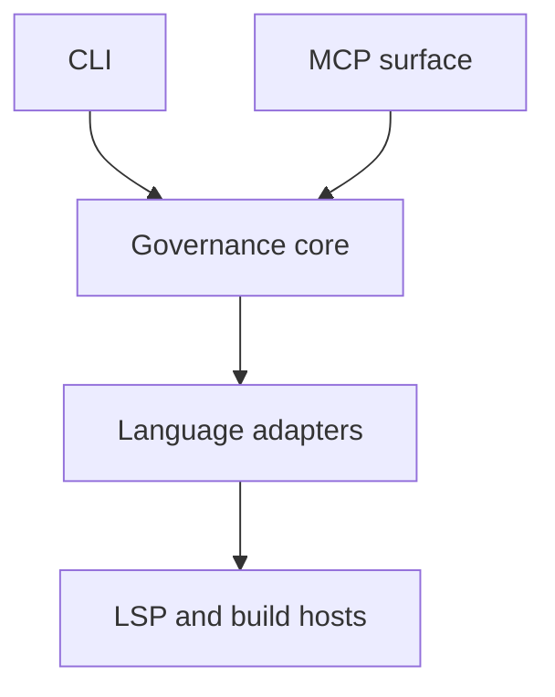

# Review of the DDD Specification Platform CLI PRD

**Document reviewed:** `ddd-cli-prd.md`  
**Review type:** Product, architecture, enforcement semantics, and implementation readiness  
**Overall assessment:** Strong direction; revision required before M3–M4 implementation

## Executive summary

The core idea is strong and unusually coherent. The PRD describes a distinctive product rather than a generic governance tool decorated with Decision-Driven Design terminology. Its central position—**curation, not mining**—gives the platform a clear identity: commitments are recorded explicitly, and implementation is checked against them.

The graph-backed explanation of diagnostics could provide real value as early as M1–M2. The separation of predicates, closure claims, decisions, seams, and enforcement arrangements is conceptually disciplined, and the proposed tooling follows from the framework rather than merely borrowing its vocabulary.

However, the current document overstates what v1 can enforce. The main differentiated feature, contract-surface interception, governs only edits made through the MCP `apply_edit` path. Direct filesystem changes, IDE edits, scripts, generators, refactorings, and ordinary Git commits can bypass it. Consequently, the architecture does not yet support the broad claim that contract-surface edits must receive seam declarations before they land.

The PRD also combines several different documents: a v1 product specification, architecture decisions, research hypotheses, experiment results, and an M5–M8 roadmap. This creates internal contradictions and makes the actual implementation contract harder to identify.

The next revision should focus on precisely defining the chain:

> **code change → detected contract event → seam obligation → declaration → durable discharge → CI verification**

If that chain becomes precise and applies to repository state rather than only one cooperative edit route, the product can credibly become an enforcement substrate.

## What is strongest

### 1. The product has a clear thesis

The statement below is the clearest expression of the platform’s identity:

> Curation, not mining: the graph is the source of truth and the code must conform to it.

This distinguishes the tool from code-search products, automatically inferred architecture graphs, analyzer dashboards, and documentation generators. The tool records commitments and checks conformance against them.

### 2. The conceptual distinctions are disciplined

The PRD correctly preserves several load-bearing distinctions:

- Predicates are definitional and do not carry status.
- Closure claims are truth-apt and statused.
- Decisions are volitional and have principals.
- Analyzer and linter rules require governing decisions.
- A static HTML view is a projection, never another source of truth.
- Claim staleness and basis loss are operational conditions rather than documentation concerns.

These distinctions prevent the graph from collapsing propositions, evidence, commitments, and implementation mechanisms into one generic record type.

### 3. Several architecture choices are sound

Particularly strong choices include:

- Keeping language-specific contract knowledge out of the governance core.
- Using SARIF as the normalized representation of emitted build diagnostics.
- Delivering M1–M2 value without depending on LSP hosting.
- Treating pattern detection as conformance checking rather than open-ended mining.
- Keeping the graph repo-local, diffable, and versioned with the governed code.
- Including failure signals in the success criteria.
- Treating the tool’s own repository as an early user.

### 4. The document acknowledges falsifiability

Adapter policy rows, adoption friction, noisy manifest diffs, unused `why` explanations, and weak structural proxies are all described as claims that can fail. This is substantially better than presenting architectural preferences as settled facts.

## Principal finding: enforcement is narrower than claimed

The PRD says the platform “mechanically enforces” governing decisions and that contract-surface edits demand declarations before committing. The proposed interceptor, however, applies only when an edit is submitted through the MCP `apply_edit` tool.

It does not govern:

- Direct filesystem writes by agents
- IDE and editor changes
- Shell scripts
- Refactoring tools
- Generated code
- Manual edits
- Git commits made without the MCP server

The defensible v1 claim is therefore:

> Contract-surface edits made through the governed `apply_edit` path require a declaration before that tool applies them.

That is a useful interaction feature, but it is not a repository-wide enforcement boundary.

### Recommendation

Use two complementary layers:

1. **Edit-time interception** for immediate feedback during governed agent interaction.
2. **Repository-state validation** in `ddd diff` or `ddd validate`, comparing changed contract surfaces with declarations.

CI should be the authoritative gate. MCP interception should be the low-latency interaction layer. Direct edits must remain visible to the repository-level check.

## Critical specification gaps

### 1. A declaration is not durably bound to the change it discharges

The phrase “matching seam/pattern declaration in the same session” is insufficiently precise. The PRD does not define:

- What constitutes a session
- Whether sessions survive process restarts
- How a declaration identifies its associated edit
- Whether it refers to a symbol, source range, file hash, revision, or semantic diff
- What happens when code changes after the declaration
- Whether one declaration can discharge multiple edits
- Whether an old declaration can authorize a later unrelated edit

Without a durable binding, declarations risk becoming generic permission slips.

A declaration could, for example, bind to a normalized semantic change:

```yaml
subject:
  symbol: "M:Example.IOrderService.Submit(Order)"
change:
  kind: parameter-added
  before_hash: "..."
  after_hash: "..."
base_revision: "..."
```

The exact representation can differ, but the invariant should be explicit: **a declaration cannot discharge a change other than the change it identifies.**

### 2. Contract-surface events and seams are conflated

A public API change is evidence of a possible seam obligation. It is not necessarily the creation of a seam.

Examples include:

- Adding a member to an already-declared interface
- Adding an output to a deployment module used within one ownership boundary
- Changing a public type that has no external consumers
- Introducing a private integration with an external system
- Changing serialization behavior without changing the public C# signature

The classifier detects syntactic or semantic contract events. A seam in the framework is a demand-bearing boundary that encodes verdict-relevant information.

The model should distinguish:

| Concept | Meaning |
|---|---|
| Contract-surface event | Mechanically detected syntax or symbol change |
| Seam candidate | Event that may create or alter a demand-bearing boundary |
| Seam declaration | Filed account of the actual boundary, absorbed demand, and obligations |

This prevents the tool from claiming it mechanically detected a seam when it detected only a proxy.

### 3. The graph identity model is incomplete

The directory layout is clear, but several foundational rules remain undefined:

- Canonical ID syntax and uniqueness scope
- Whether filenames determine identity
- Reference and version syntax
- Rename and deletion semantics
- Tombstones and historical resolution
- Local versus `shared/` precedence
- Duplicate definitions
- Cross-file transaction rules
- Forward-compatible extension fields
- Canonicalization used for hashing
- Stable error codes for validation failures

These questions should be settled before focusing on later language-host details.

### 4. “Inheritance” currently appears to mean copying

The success criteria say a second repository inherits decisions from the first repository’s `shared/` entries. Without a catalog or ledger relationship, that appears to be file copying.

True inheritance requires at least:

- Origin identity and provenance
- Pinned upstream version
- Update detection
- Local override rules
- Divergence handling
- Basis-loss or revocation propagation

For v1, call the operation **import** unless the system tracks an upstream relationship.

### 5. Pre-M8 basis-loss detection is too weak

Pinning a claim’s status and `changed` date does not uniquely identify the state on which a decision was based. Dates can be changed, duplicated, or affected by irrelevant edits.

Better temporary mechanisms include:

- A content hash over the canonicalized claim
- An explicit claim revision ID
- A Git blob identifier
- A clear statement that the M2 mechanism is heuristic

Because basis loss is load-bearing to the product thesis, content-addressed basis pins should probably arrive earlier than M8.

### 6. Requiring every decision to cite a closure claim is too rigid

The rule that every decision must have at least one `basedOn` closure claim does not naturally represent:

- Preferences
- Legal or contractual mandates
- Explicit bets under uncertainty
- Time-boxed experiments
- Emergency responses
- Choices made because evidence is absent
- Priorities between equally supported alternatives

Requiring a typed basis would be more robust:

```text
claim | constraint | mandate | preference | experiment | risk acceptance
```

Otherwise, users may manufacture weak closure claims solely to pass validation.

## Architecture concerns

### 1. The layer diagram does not accurately express the dependency structure

The diagram places governance above MCP and MCP above LSP. In practice, CLI and MCP are two entry surfaces into the governance core, which calls adapters and their language/build hosts.



This structure makes it clear that CLI validation remains usable without MCP.

### 2. The adapter contract is understated

The PRD says an adapter answers “exactly three questions,” but assigns adapters many additional duties:

- LSP lifecycle and readiness
- Workspace and solution discovery
- Diagnostic normalization
- SARIF invocation
- Configuration parsing
- Contract classification
- Semantic before/after comparison
- Composition-root detection
- Ground-provenance classification
- Pattern detection

The three-question formulation is conceptually attractive but technically inaccurate.

A cleaner decomposition would separate:

- Language host
- Diagnostic provider
- Configuration provider
- Contract-surface classifier
- Optional pattern detectors

This preserves the no-language-knowledge-in-core rule while avoiding a monolithic adapter interface.

### 3. LSP does not automatically provide reliable edit interception

LSP supplies symbols, diagnostics, references, and workspace edits, but it does not directly provide a normalized semantic before/after contract diff for arbitrary text edits.

The PRD should state whether interception works by:

1. Applying the edit to an in-memory document
2. Re-querying semantic/document symbols
3. Comparing normalized before and after surfaces
4. Rejecting or committing the filesystem change

That design must address:

- Document versions
- Stale clients
- Multi-file edits
- Formatter changes
- Server synchronization
- Atomic filesystem commits
- Rollback after partial failure

### 4. Configured and emitted rules are different populations

SARIF is a sensible common representation for emitted diagnostics, but it does not establish the complete rule population.

The design must distinguish:

| State | Meaning |
|---|---|
| Available | Rule exists in an installed analyzer or tool |
| Configured | Repository explicitly assigns configuration or severity |
| Executed | Rule participated in an analysis run |
| Emitted | Rule produced at least one diagnostic |
| Governed | Rule maps to a governing decision |

A manifest entry should not be considered `STALE` merely because its rule was absent from configuration and emitted diagnostics. Absence of emission is not evidence that a rule no longer exists. Staleness should normally be established against the installed rule catalog.

## Internal contradictions and temporal problems

### 1. M6 is both future and completed

M6 is presented as a future milestone and a pre-registered falsification test. The risk section nevertheless reports confirmed M6 results, including “2 instances / 114 lines” and named reported decisions.

If the experiment occurred, M6 is not future. If it did not occur, its outcome cannot be presented as observed evidence. Predicted and observed outcomes must be separated, particularly when the test is described as pre-registered.

### 2. M7 contains implementation history inside a roadmap item

The M7 preamble names an existing decision, a specific policy amendment, and a fixture change excluded by an experiment. This reads as a changelog or decision record rather than a milestone definition.

That history may belong in the graph or an accompanying design note. The milestone table should state what M7 must deliver and what claim it tests.

### 3. The MCP SDK description conflicts with the runtime decision

Section 8 says tools follow an official SDK’s “attribute model,” while section 5 says the implementation reuses Rust `product-mcp` plumbing and supersedes the earlier C# MCP SDK choice.

The PRD should define protocol-level tool schemas and behavior rather than attributes belonging to a superseded implementation.

### 4. The .NET dependency is described misleadingly

The Rust executable may not embed or link against .NET, but launching Roslyn and Bicep language servers requires an appropriate .NET installation. Operational prerequisites should be stated from the user’s perspective rather than the implementation binary’s perspective.

## Product scope

The document currently covers several products and research tracks:

- Repository governance graph
- Analyzer and linter governance
- LSP-backed coding tools
- Contract-surface interception
- Static graph reporting
- Cross-repository catalog propagation
- Decision Ledger integration
- Correspondence-data collection
- Rust and HTML/CSS governance

The milestone structure helps, but later work occupies enough of the PRD to obscure the v1 contract.

### Recommended document split

1. **v1 product requirements:** M1–M4 only.
2. **Architecture decision record:** product-cli, SHACL, SARIF, LSP, and adapter boundaries.
3. **Research protocol:** correspondence dataset and adapter-cost falsification.
4. **Roadmap:** M5–M8.
5. **Ontology references:** predicates, claims, DAD, and Decision Ledger.

The existing document can remain an umbrella design, but it should not be the sole implementable PRD.

## Missing operational requirements

The v1 requirements should establish expected behavior for:

- Monorepositories and multiple solutions
- Repository-root discovery
- Partial and broken builds
- Generated code
- Renames and moves
- Multi-file and multi-language edits
- Concurrent MCP clients
- YAML write locking and atomic replacement
- Crash recovery during graph writes
- Git worktrees
- Symlinks and path traversal
- Untrusted repository content
- MCP write authorization
- Maximum graph and SARIF sizes
- Stable machine-readable output
- JSON output for CI-facing commands
- Stable diagnostic and finding IDs
- Suppression expiry
- Adoption baselines for existing repositories
- Deterministic rendering
- Sensitive metadata and source-path handling
- Language-server absence, failure, and restart

Not all of these require complete designs in the PRD, but the expected v1 behavior should be named.

## Success-criteria revisions

The current success criteria are directionally useful, but several can be satisfied without proving the intended claims.

- Twenty declarations measures volume, not quality.
- One inherited decision proves little if inheritance is only file copying.
- Completion without human unblocking may encourage rubber-stamped declarations.

Add measurable criteria for:

- Contract-change recall on a hand-labelled fixture set
- False-demand rate for non-contract changes
- Percentage of declarations judged meaningful on review
- Median time required to resolve an interception
- Bypassed edits caught by repository or CI validation
- Deterministic `validate`, `diff`, and `render` results
- Rejection of stale or unrelated declarations
- Graph migration and round-trip compatibility
- LSP crash and restart recovery
- Maximum acceptable warm-up latency
- Correct detection of at least one real basis-loss event

## Recommended v1 invariants

The implementation would benefit from a small normative invariant set:

1. Every governed finding resolves to exactly one current governing decision or is reported as ungoverned.
2. Every governing decision has a stable identity, named principal, typed basis, and pinned basis version.
3. No declaration can discharge a code change other than the change it explicitly identifies.
4. MCP interception and repository-state validation use the same contract classifier.
5. Direct edits cannot bypass the CI-visible governance result.
6. The governance-core crate cannot import language-specific knowledge.
7. Projections and reports never modify the graph.
8. Validation results are deterministic for a fixed repository state and tool version.
9. Failure or absence of a language host is reported explicitly and never interpreted as “no findings.”
10. Imported decisions preserve origin identity and their pinned upstream version.

These invariants provide better foundations for automated tests than broad narrative assertions.

## Recommended priority order

### Before M1

- Define graph identity, versioning, canonical hashes, typed bases, and imports.
- Separate v1 requirements from roadmap and research content.
- Resolve the M6 temporal contradiction.

### Before M2

- Define the rule-state model: available, configured, executed, emitted, and governed.
- Rework `STALE` semantics.
- Specify adoption baselines and deterministic CI output.

### Before M3

- Replace the monolithic adapter notion with explicit capability interfaces.
- Define host failure, readiness, document synchronization, and monorepo behavior.

### Before M4

- Specify before/after semantic classification.
- Define the durable declaration-to-change binding.
- Add repository-diff enforcement so `apply_edit` is not the only governed path.
- Define atomicity and concurrent-session behavior.
- Establish a hand-labelled classifier test corpus.

## Conclusion

This is a compelling architecture document and a credible operational expression of Decision-Driven Design. M1–M2 could deliver useful governance and diagnostic-explanation capabilities without depending on the riskiest parts of the architecture.

The differentiated M4 claim is not yet specified tightly enough. It currently governs one cooperative edit route and risks turning public-surface changes into mechanically demanded but semantically weak seam declarations.

The next draft should spend less space on later adapters and more on the exact semantics connecting a repository change to a detected contract event, a justified obligation, a declaration, a durable discharge, and an authoritative CI result. Once that chain is explicit, testable, and resistant to bypass, the platform can credibly claim to be an enforcement substrate rather than merely a governed agent interface.